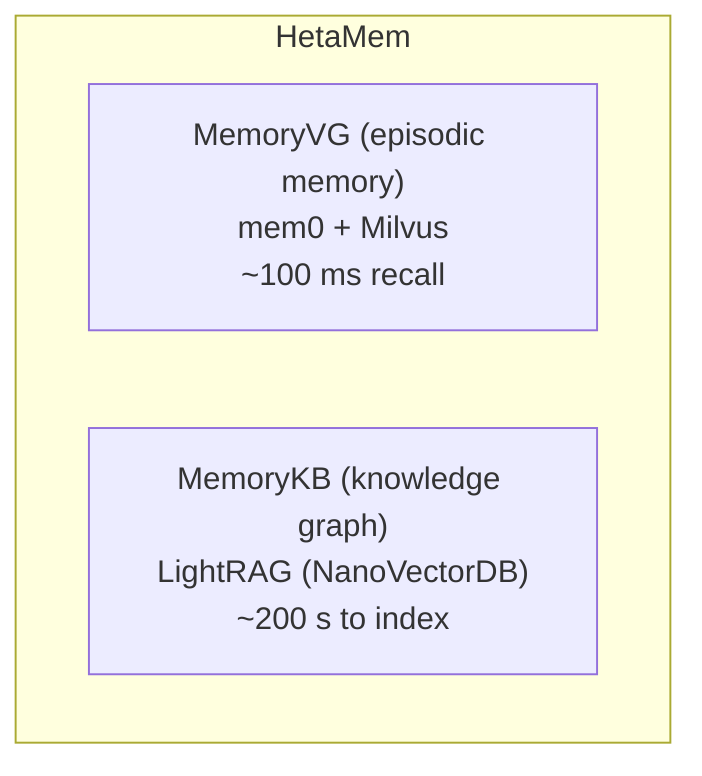

# HetaMem

HetaMem is Heta's agent memory subsystem. It provides two complementary layers
that together give an agent both fast episodic recall and a growing long-term
knowledge graph.

---

## Dual-Layer Architecture

---

## MemoryVG vs MemoryKB

| | MemoryVG | MemoryKB |
|---|---|---|
| **Engine** | mem0 + Milvus | LightRAG (NanoVectorDB) |
| **Built by** | Agent (from conversations) | Agent (explicit text inserts) |
| **Index time** | Immediate | ~200 s (async) |
| **Query latency** | ~100 ms | ~1 s |
| **Storage model** | Individual fact embeddings | Knowledge graph (entities + relations) |
| **Retrieval** | Semantic similarity | `hybrid` / `local` / `global` graph modes |
| **CRUD** | Full (get / update / delete / history) | Insert + query only |
| **Best for** | Cross-session fact cache; conversation memory | Accumulating domain knowledge over time |

---

## Scope Isolation

Every memory operation is scoped by one or more of three identifiers:

| Identifier | Meaning |
|---|---|
| `user_id` | Isolates memories per end user |
| `agent_id` | Isolates memories per agent instance |
| `run_id` | Isolates memories to a single conversation run |

Pass the relevant scope fields on every `add`, `search`, `insert`, and `query`
call. Memories created under one scope are invisible to other scopes.

---

## Layer Selection Guide

| Layer | Best for | Typical latency |
|---|---|---|
| **MemoryVG** | Facts already seen; cross-session cache; conversation history | ~100 ms |
| **HetaDB** | Deep retrieval from uploaded human documents | 1–3 s |
| **MemoryKB** | Agent's accumulating long-term knowledge graph | ~200 s to index · ~1 s to query |

Use MemoryVG first for fast recall. Fall back to HetaDB for document knowledge.
Store new findings back into MemoryVG for instant recall next time, and into
MemoryKB when the knowledge is worth accumulating across restarts.

---

## Sub-pages

- [MemoryVG](memoryvg.md) — episodic memory: add, search, CRUD operations
- [MemoryKB](memorykb.md) — long-term knowledge graph: insert, query, modes
- [Querying Skill](querying-skill.md) — orchestration guide for agents
