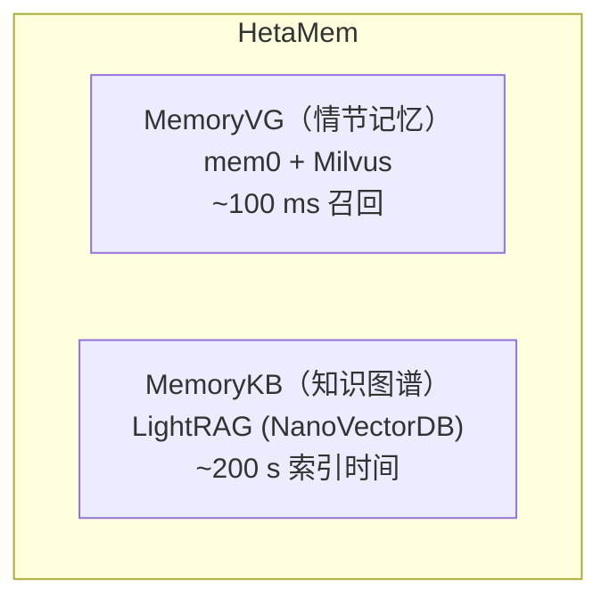

# HetaMem

HetaMem 是 Heta 的 Agent 记忆子系统，提供两个互补的记忆层，共同为 Agent 提供快速的情节回忆能力和持续增长的长期知识图谱。

---

## 双层架构

---

## MemoryVG 与 MemoryKB 对比

| | MemoryVG | MemoryKB |
|---|---|---|
| **引擎** | mem0 + Milvus | LightRAG (NanoVectorDB) |
| **构建方** | Agent（从对话中提取） | Agent（主动文本插入） |
| **索引时间** | 即时 | ~200 秒（异步） |
| **查询延迟** | ~100 毫秒 | ~1 秒 |
| **存储模型** | 独立事实嵌入向量 | 知识图谱（实体 + 关系） |
| **检索方式** | 语义相似度 | `hybrid` / `local` / `global` 图检索模式 |
| **增删改查** | 完整支持（get / update / delete / history） | 仅支持 insert 和 query |
| **适用场景** | 跨会话事实缓存；对话记忆 | 长期积累领域知识 |

---

## 作用域隔离

每次记忆操作通过以下三个标识符中的一个或多个进行作用域隔离：

| 标识符 | 含义 |
|--------|------|
| `user_id` | 按终端用户隔离记忆 |
| `agent_id` | 按 Agent 实例隔离记忆 |
| `run_id` | 将记忆隔离到单次对话会话 |

每次 `add`、`search`、`insert`、`query` 调用时请传入对应的作用域字段。不同作用域下创建的记忆互不可见。

---

## 记忆层选择指南

| 层 | 最适合 | 典型延迟 |
|---|---|---|
| **MemoryVG** | 已见事实；跨会话缓存；对话历史 | ~100 毫秒 |
| **HetaDB** | 从上传的人类文档中深度检索 | 1–3 秒 |
| **MemoryKB** | Agent 持续积累的长期知识图谱 | 索引 ~200 秒 · 查询 ~1 秒 |

优先使用 MemoryVG 进行快速召回，文档知识则回落到 HetaDB 检索。将新发现存入 MemoryVG 以便下次快速调取；若该知识值得跨重启持久保存，则同步写入 MemoryKB。

---

## 子页面

- [MemoryVG](memoryvg.zh.md) — 情节记忆：添加、搜索、增删改查操作
- [MemoryKB](memorykb.zh.md) — 长期知识图谱：插入、查询、检索模式
- [查询技能](querying-skill.zh.md) — Agent 编排指南
